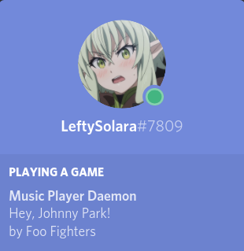

# MPD Rich Presence for Discord

A program to display your currently-playing MPD track in Discord.

This was originally a learning project and written for my own personal use. Thus, it's a very basic implementation.
For a more feature-rich version of this, check out [SSStormy's version](https://github.com/SSStormy/mpd-rich-presence-discord).

## Command Line Arguments

| Option                            | Purpose                                                                                 |
| --------------------------------- | --------------------------------------------------------------------------------------- |
| `-h HOST`,    `--host HOST`       | The host MPD is listening on. Can be a hostname or IP address (defaults to `localhost`) |
| `-p PORT`,    `--port PORT`       | The port MPD is listening on (defaults to `6600`)                                       |
| `-t TIMEOUT`, `--timeout TIMEOUT` | The timeout length for MPD requests in milliseconds (defaults to `30000`)               |

## Compiling

### Dependencies
- CMake
- [discord-rpc](https://github.com/discordapp/discord-rpc)
- [libmpdclient](https://www.musicpd.org/libs/libmpdclient/)

An [installation script](install.sh) is also included.

## Screenshot

